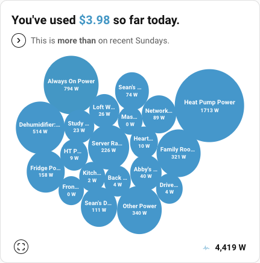
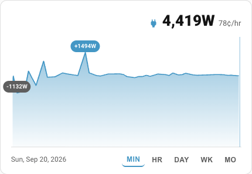
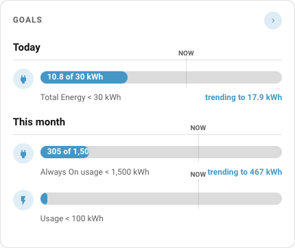
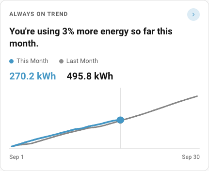
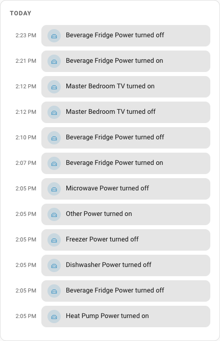

# SenseLike Cards for Home Assistant

Lovelace dashboard cards styled after the Sense energy monitoring app.

- **Theme-aware** — uses your Home Assistant theme colors (customizable per-card)
- **Works with anything** — Sense integration, MQTT sensors, utility meters, or any Home Assistant entity
- **Modern browser** — requires CSS `color-mix()` support (Chrome/Edge 111+, Safari 16.2+, all current HA apps)

## Cards at a Glance

### Device Bubbles — `senselike-device-bubbles-card`
Circle-packed bubble chart showing power consumption per device, with today's activity timeline. Perfect for understanding which devices are using the most energy right now.



### Power Meter — `senselike-power-meter-card`
Live instantaneous power display with area chart. Switch between MIN/HR/DAY/WK/MO views to see power trends at different timescales, with automatic cost calculation.



### Goals — `senselike-goals-card`
Progress bars for energy targets (daily, weekly, monthly). Shows current usage, target goal, and trend projection to help you stay on track.



### Usage Trend — `senselike-usage-trend-card`
Compare this month vs. last month cumulative energy or cost with a line chart. See at a glance whether you're using more or less than last month.



### Timeline — `senselike-timeline-card`
Chronological event log showing device on/off events throughout the day. Understand exactly when devices turned on and off and track patterns in your home's activity.



## Installation

### Via HACS (recommended)

1. In Home Assistant, go to **Settings → Devices & Services → HACS**
2. Click **Explore & Download Repositories**
3. Search for "SenseLike" and install
4. Restart Home Assistant

### Manual

1. Copy `www/senselike-cards/` into your Home Assistant `config/www/` directory
2. In **Settings → Dashboards → Resources**, add as **JavaScript Module**:
   - `/local/senselike-cards/senselike-device-bubbles-card.js`
   - `/local/senselike-cards/senselike-power-meter-card.js`
   - `/local/senselike-cards/senselike-goals-card.js`
   - `/local/senselike-cards/senselike-usage-trend-card.js`
   - `/local/senselike-cards/senselike-timeline-card.js`
3. Add cards to your dashboard in YAML mode (see `example-dashboard.yaml`)

## Requirements

- **Home Assistant** 2024.6.0+
- **Browser/WebView** supporting CSS `color-mix()` (Chrome/Edge 111+, Safari 16.2+, all current HA apps)
- **For trend/meter cards**: entities with [long-term statistics](https://www.home-assistant.io/docs/energy/statistics/) enabled
- **For device timeline**: [Logbook API](https://www.home-assistant.io/docs/frontend/custom-card/) access

## Quick Config Examples

**Device Bubbles** — show what's using power right now:
```yaml
type: custom:senselike-device-bubbles-card
title: Now
cost_entity: sensor.energy_cost_today
current_power_entity: sensor.house_power
devices:
  - entity: sensor.fridge_power
    name: Fridge
  - entity: sensor.hvac_power
    name: HVAC
```

**Power Meter** — live power + cost tracking:
```yaml
type: custom:senselike-power-meter-card
title: Meter
entity: sensor.house_power      # instantaneous power (W)
price_per_kwh: 0.14
```

**Goals** — track usage targets:
```yaml
type: custom:senselike-goals-card
title: Goals
goals:
  - name: Daily Usage
    entity: sensor.energy_today
    target: 30
    unit: kWh
    period: day
```

**Usage Trend** — month-over-month comparison:
```yaml
type: custom:senselike-usage-trend-card
title: Usage
entity: sensor.home_energy_cost  # with long-term statistics
unit: "$"
decimals: 0
```

See [`example-dashboard.yaml`](example-dashboard.yaml) for a complete working example.
